# E-Wallet API

A comprehensive e-wallet API built with Laravel for managing digital transactions, wallet operations, and financial services.

## 🚀 Features

- Digital wallet management
- Transaction processing
- Money transfer capabilities
- Payment processing
- Transaction history tracking
- Fee calculation
- Rate limiting protection

## 🛠️ Technology Stack

- **Framework**: Laravel v11.44.7
- **PHP Version**: 8.3.22
- **Database**: MySQL/PostgreSQL
- **Queue System**: RabbitMQ
- **Rate Limiting**: Built-in Laravel throttling

## 📋 API Endpoints

All API endpoints are rate-limited to **60 requests per minute** per user/IP address.

### 🏦 Wallet Management

#### Get Wallet Balance
```http
GET /api/wallet/getBalance
```
Retrieves the current balance of the user's wallet.

#### Create Wallet
```http
POST /api/wallet/wallet
```
Creates a new wallet for a user.

#### Deposit Money
```http
POST /api/wallet/deposit
```
Deposits money into the user's wallet.

**Request Body:**
```json
{
    "amount": "100.00",
    "description": "Deposit description"
}
```

#### Withdraw Money
```http
POST /api/wallet/withdraw
```
Withdraws money from the user's wallet.

**Request Body:**
```json
{
    "amount": "50.00",
    "description": "Withdrawal description"
}
```

#### Get Wallet by User ID
```http
GET /api/wallet/by-user
```
Retrieves wallet information for a specific user.

### 💸 Transaction Management

#### Get Transaction History
```http
GET /api/transaction/history
```
Retrieves the transaction history for the authenticated user.

**Response:**
```json
{
    "data": [
        {
            "display": "Transaction Display Name",
            "id": 1,
            "amount": "100.00",
            "type": "deposit",
            "description": "Transaction description",
            "date": "14 Feb 2025",
            "time": "02:30 PM",
            "logo": "https://e-wallet.azurewebsites.net"
        }
    ]
}
```

#### Make Payment
```http
POST /api/transaction/pay
```
Processes a payment transaction.

**Request Body:**
```json
{
    "recipient_id": "user123",
    "amount": "25.00",
    "description": "Payment for services"
}
```

**Payment Flow:**

```mermaid
graph TD;
    A["🛒 Start Payment Request"] --> B{"📝 Validate Request & Signature"};
    B --> C{"🔄 Initiate Async Bill Fetch"};
    B --> D{"👤 Fetch User Wallet from Redis Cache"};
    B --> E{"🔐 Verify Digital Signature"};

    subgraph "Parallel Operations"
        C;
        D;
        E;
    end

    C --> F{"⏳ Wait for Operations Complete"};
    D --> F;
    E --> F;

    F --> G{"🏪 Fetch Merchant Wallet from Redis Cache"};
    G --> H{"🛡️ Initiate Async Fraud Check"};
    H --> I{"💰 Check User Balance"};
    I --> J["🔄 Begin DB Transaction"];

    subgraph "Database Transaction"
        J --> K{"💸 Debit/Credit Wallets<br/>📊 Create Transaction Records<br/>🗂️ Update Redis Cache"};
        K --> L{"⏳ Wait for Fraud Check Result"};
        L --> M{"🚨 Fraud Detected?"};
        M -- "Yes" --> P["🔄 Rollback DB Transaction<br/>♻️ Invalidate Cache"];
        M -- "No" --> N{"📋 Update External Bill Status"};
        N --> O{"✅ Update Succeeded?"};
        O -- "Yes" --> Q["✅ Commit DB Transaction<br/>💾 Update Redis Cache"];
        O -- "No" --> P;
    end

    subgraph "Signature & Security Flow"
        E --> E1["🔍 Extract Public Key"];
        E1 --> E2{"🔐 Signature Valid?"};
        E2 -- "No" --> E3["❌ Return Signature Error"];
        E2 -- "Yes" --> F;
    end

    Q --> R["🧾 Generate Payment Receipt<br/>📧 Send Confirmation"];
    P --> S["❌ Payment Failed"];
    R --> T["🎉 End - Success"];
    S --> T;
    E3 --> T;
    
    style A fill:#fff3e0
    style T fill:#e8f5e8
    style P fill:#ffebee
    style S fill:#ffebee
    style E3 fill:#ffebee
```


#### Send Money
```http
POST /api/transaction/send-money
```
Sends money to another user.

**Request Body:**
```json
{
    "recipient_id": "user456",
    "amount": "75.00",
    "description": "Money transfer"
}
```

**Send Money Flow:**

```mermaid
flowchart TD
    A["🚀 User initiates Send Money request"] --> B["📝 Validate request parameters<br/>(recipient_id, amount, description)"]
    B --> C{"✅ Valid request?"}
    C -->|No| D["❌ Return validation error"]
    C -->|Yes| E["🔍 Check sender's wallet balance"]
    E --> F{"💰 Sufficient balance<br/>(amount + fees)?"}
    F -->|No| G["❌ Return insufficient funds error"]
    F -->|Yes| H["👤 Verify recipient exists"]
    H --> I{"🔍 Recipient found?"}
    I -->|No| J["❌ Return recipient not found error"]
    I -->|Yes| K["🧮 Calculate transaction fees"]
    K --> L["💸 Deduct amount + fees from sender's wallet"]
    L --> M["💰 Add amount to recipient's wallet"]
    M --> N["📊 Create transaction records<br/>(for both sender and recipient)"]
    N --> O["📧 Send notifications<br/>(optional)"]
    O --> P["✅ Return success response<br/>with transaction details"]
    
    style A fill:#e1f5fe
    style P fill:#e8f5e8
    style D fill:#ffebee
    style G fill:#ffebee
    style J fill:#ffebee
```


#### Calculate Fees
```http
GET /api/transaction/cal-fees/{amount}
```
Calculates the transaction fees for a given amount.

**Parameters:**
- `amount` (path parameter): The transaction amount

**Response:**
```json
{
    "amount": "100.00",
    "fee": "2.50",
    "total": "102.50"
}
```

### 🌐 Utility Endpoints

#### Store IP Address
```http
POST /api/ip-address
```
Stores and logs IP address information for security purposes.

## 🔒 Authentication & Security

- **Rate Limiting**: All endpoints are protected with throttling middleware (60 requests/minute)
- **Headers**: Include appropriate authentication headers
- **HTTPS**: All production endpoints should use HTTPS

## 📦 Installation & Setup

1. Clone the repository
```bash
git clone <repository-url>
cd e-wallet
```

2. Install dependencies
```bash
composer install
npm install
```

3. Environment setup
```bash
cp .env.example .env
php artisan key:generate
```

4. Database setup
```bash
php artisan migrate
php artisan db:seed
```

5. Start the development server
```bash
php artisan serve
```

## 🐳 Docker Support

The application includes Docker support with `docker-compose.yml` and `Dockerfile`.

```bash
docker-compose up -d
```

## 🧪 Testing

Run the test suite:
```bash
php artisan test
```

## 📝 API Response Format

### Success Response
```json
{
    "success": true,
    "data": {...},
    "message": "Operation completed successfully"
}
```

### Error Response
```json
{
    "success": false,
    "error": "Error message",
    "code": 400
}
```

### Rate Limit Headers
When rate limits are applied, the following headers are included:
- `X-RateLimit-Limit`: The maximum number of requests allowed
- `X-RateLimit-Remaining`: Number of requests remaining
- `X-RateLimit-Reset`: Time when the rate limit resets

## 🤝 Contributing

1. Fork the repository
2. Create a feature branch
3. Make your changes
4. Add tests for new functionality
5. Submit a pull request

## 📄 License

This project is licensed under the MIT License.

## 🔗 Deployment

The application is deployed at: [https://e-wallet.azurewebsites.net](https://e-wallet.azurewebsites.net)

## 📞 Support

For support and questions, please contact the development team or create an issue in the repository.
